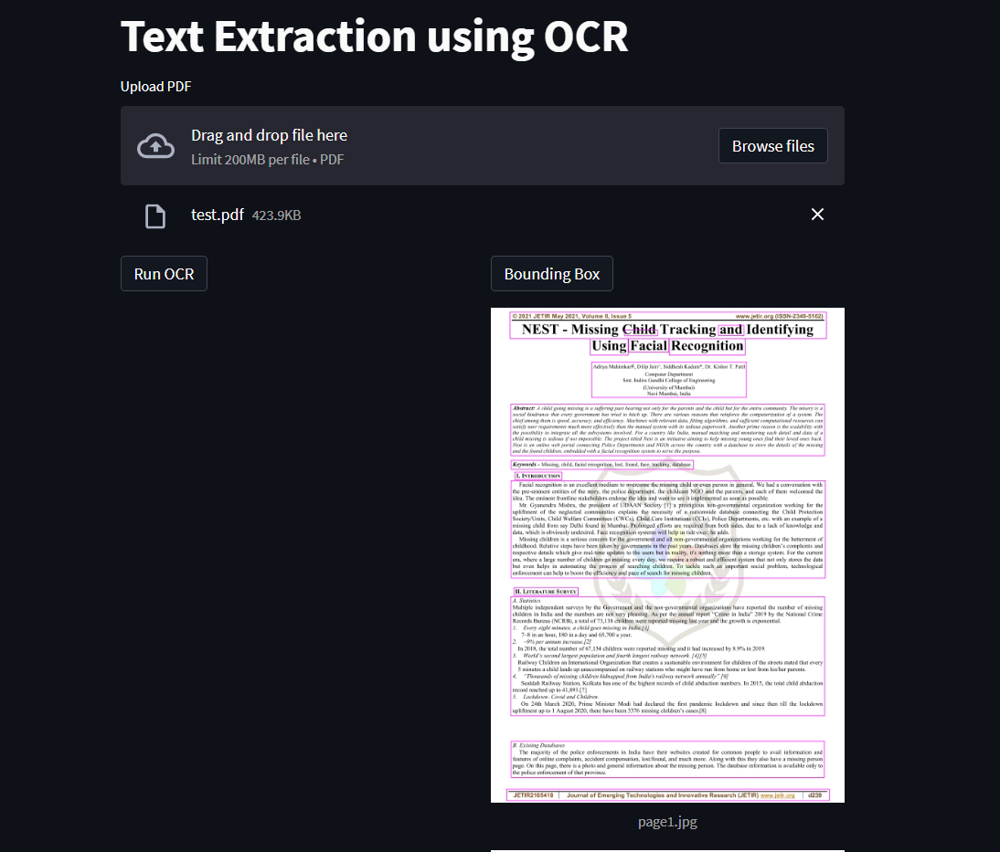
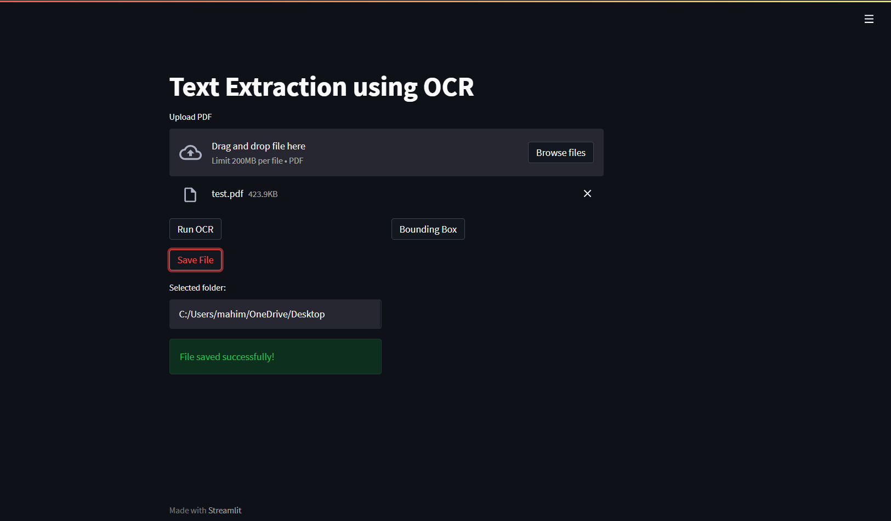
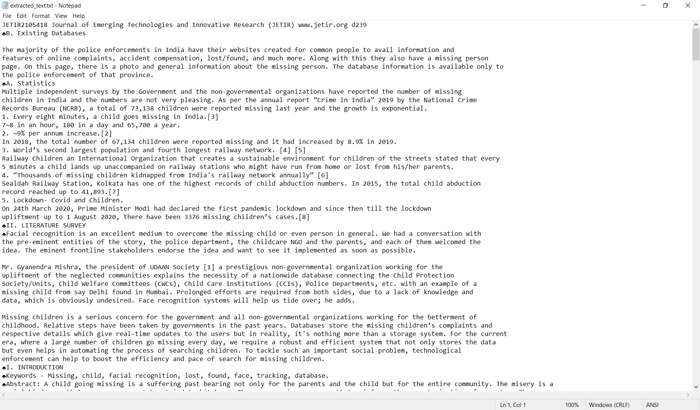

# PDF Extraction using Tesseract
- ## About
An OCR project as a Proof of Concept to deploy a machine learning project using Streamlit. The text extraction process is accompanied with image processing for better text recognition and achieving higher efficiency. 

- ## Libraries / Frameworks
    1. Streamlit - UI
    2. Tkinter - File download setup
    3. Pytesseract
    4. Pdf2Image
    5. OpenCV - Image Processing
   
- ## Code Execution
    1. Make sure you have Python 3.8 installed on the system.
    2. Open cmd where the contents are unzipped.
    3. Run the below command to install required packages.
        > pip install -r requirements.txt
    4. Install [Tesseract setup file](https://tesseract-ocr.github.io/tessdoc/Downloads.html)
    5. Once all packages are installed, run the following command:
        > streamlit run OCR.py

If facing any issues, [contact me](mailto:mahimkaradi@gmail.com)

- ## Output

Bounding Box around recognized text

Text extraction and document saved

Extracted Text Output

